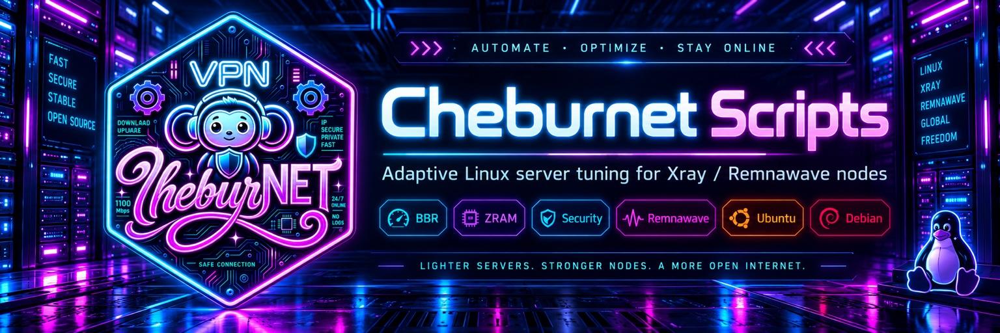

# Леонид Копысов

### Автор и разработчик ЧебурNET

**Linux · Bash · Docker · Xray · Remnawave · nginx · автоматизация инфраструктуры**

## Обо мне

Разрабатываю и сопровождаю **ЧебурNET** — набор практичных инструментов для автоматизации, оптимизации и безопасного развёртывания Linux-инфраструктуры на базе Xray и Remnawave.

Основной принцип моих проектов: сложная серверная настройка должна выполняться понятно, воспроизводимо и с обязательной проверкой результата.

## Проекты ЧебурNET

| Проект | Назначение |
|---|---|
| [**CheburNET Auto Tuning**](https://github.com/leonidkopysov/CheburNET-Auto-Tuning) | Адаптивная оптимизация и защита Linux-серверов: BBR, ZRAM, sysctl, firewall, Fail2ban и диагностика |
| [**CheburNET Vision Installer**](https://github.com/leonidkopysov/CheburNET-Vision-Installer) | Установка VLESS TLS Vision, RemnaNode, сертификатов и Unix-Socket Decoy для Remnawave |

## Что для меня важно

- безопасные настройки по умолчанию;
- автоматическая проверка после установки;
- понятные сообщения и документация на русском языке;
- воспроизводимые конфигурации без скрытых ручных действий;
- уважение к лицензиям сторонних компонентов.

## Технологии

`Linux` · `Bash` · `Docker` · `Python` · `nginx` · `Xray` · `Remnawave` · `systemd` · `UFW` · `Fail2ban`

## Контакты

- GitHub: [@leonidkopysov](https://github.com/leonidkopysov)
- Telegram: [@kopysovleonid](https://t.me/kopysovleonid)

